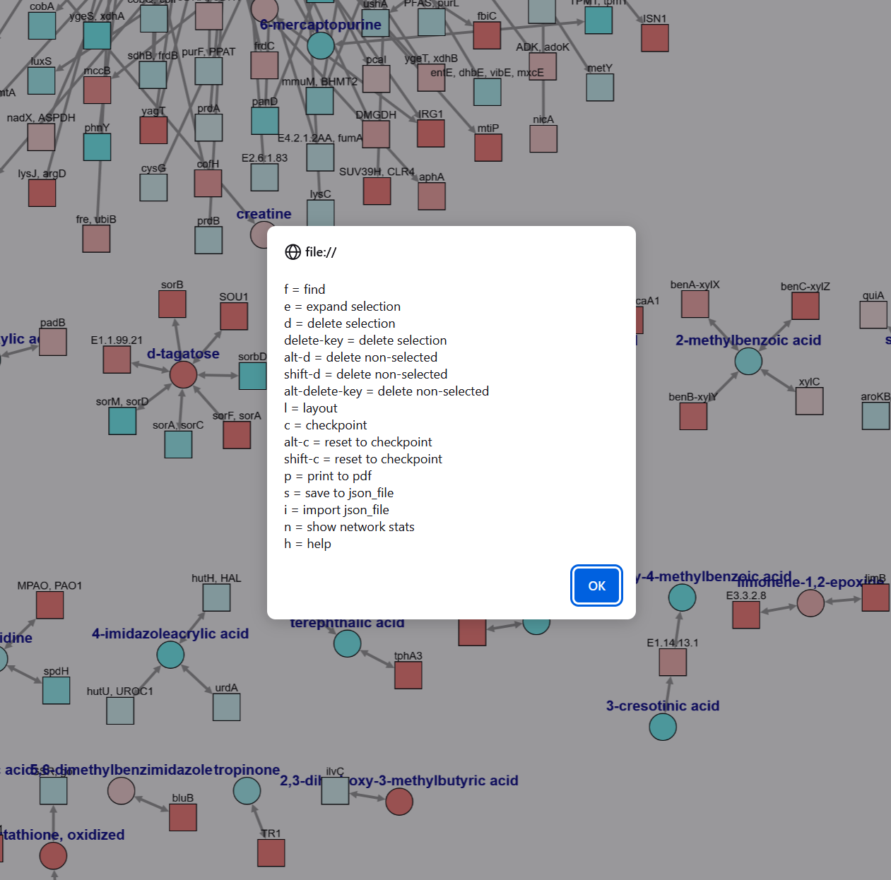

# UA_vs_BAL


### Combined Analysis of Metagenomic and Metabolomic Data by Projection onto a Curated Reaction Network 

---

To regenerate the published projection of the combined metagenomic and proteomic data simply run the following python command:

```python
python analyze_metagenomic_data.py
```

This will use the exact data files (`BAL_vs_UA_gx.tsv`,  `BAL_vs_UA_mx.tsv`) and network definition (`reaction_network.tsv`) as in the publication and should produce the same files as can be found in the `example_heatwave_output` folder. Note that the script assumes the [`networkx`](https://networkx.org/) and [`numpy`](https://numpy.org/) packages have been installed.

When viewing the resulting html file (`heatwave.html`), pressing 'h' brings up a menu of viewing/editing options:




To generate an up-to-date network using [KEGG's public REST-ful API](https://www.kegg.jp/kegg/rest/keggapi.html), run the following python command:

```python
python create_metagenomic_network.py
```

This should produce a newer version of the `reaction_network.tsv` file as well as a cache of downloaded information from the KEGG website (in the `data_cache` folder which the script will create). Note that, in addition to the previously mentioned [`networkx`](https://networkx.org/)  and [`numpy`](https://numpy.org/) packages, the script assumes that the [`requests`](https://github.com/psf/requests) package is also installed.
